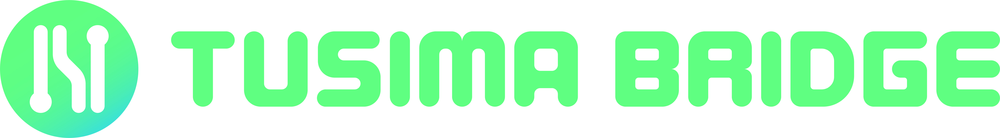
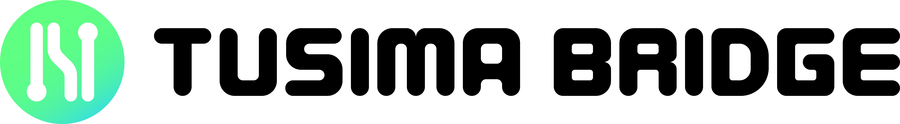

# Branding kit

## Logo\_PNG

<figure><figcaption></figcaption></figure>

<figure><figcaption></figcaption></figure>

<figure><figcaption></figcaption></figure>

<figure><figcaption></figcaption></figure>

<figure><figcaption></figcaption></figure>

## Logo\_SVG

<figure><figcaption></figcaption></figure>

<figure><figcaption></figcaption></figure>

## Primary Palette

<figure><figcaption></figcaption></figure>
